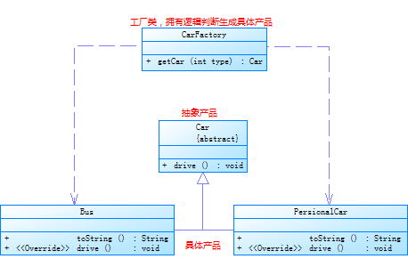

# StartFromZero-DesignPatterns
## 代理模式（Proxy）
　　代理模式是通过代理类完成预处理消息、过滤消息、把消息转发给被代理类以及事后处理消息等工作。  
　　根据代理创建的时期，可以分为静态代理和动态代理。
### 静态代理
- 特点：  
　　在程序执行前，代理类字节码文件就已生成出来。
- 缺点：  
　　每个代理类只能为一个接口服务，如果新增接口方法，还需要新增相应的代理方法，造成代码冗余。

### 动态代理
- 特点：  
　　在程序运行时动态生成代理类字节码，无需编写源代码
- JDK和CGLIB(Code Generation Library)  
　　JDK和CGLIB都为实现动态代理提供了解决方案，但其原理不尽相同。  
	－ JDK只能为实现接口的类做代理，且只能代理接口方法。  
	　　　　创建代理对象，JDK将会做以下工作：  
		　　　　1. 获取被代理对象上的所有接口列表  
		　　　　2. 确定要生成的代理类的类名，默认为：com.sun.proxy.$ProxyXXX  
		　　　　3. 动态创建代理类的字节码  
		　　　　4. 将字节码转换为class对象  
		　　　　5. 创建InvocationHandler实例handler，实现invoke方法，用来处理代理类所有方法调用  
		　　　　6. 将handler作为代理类入参，创建代理类对象  
	- CGLIB基于继承机制，通过继承被代理类，重写方法实现代理。由于受限于继承机制，不能为被final修饰的类或方法代理  
	　　　　创建代理对象，CGLIB将会做以下工作：  
		　　　　1. 获取所有被代理类非final的public方法  
		　　　　2. 将这些方法转换成字节码  
		　　　　3. 将字节码转换成相应的代理的class对象  
		　　　　4. 创建MethodInterceptor实例，实现intercept方法，用来处理代理类的方法调用  
	CGLIB所创建的动态代理对象的性能比JDK要高出不少，但CGLIB在创建代理对象时所花费的时间要比JDK动态代理多，所以对于singleton的代理对象或者具有实例池的代理，因为无需频繁的创建代理对象，所以比较适合用CGLIB动态代理技术，反之适合用JDK动态代理技术

## 建造者模式（Builder)  
　　由一些简单对象一步步建造成复杂对象，将复杂对象的构建与表示分离，使得同样的构建过程可以创建不同的表示  

## 策略模式(Strategy)
策略模式定义了算法家族，分别封装起来，让他们之间可以相互替换。让算法的变化，不会影响到用户  
策略模式的三个组成元素  
- 上下文对象：持有抽象策略的引用
- 抽象策略对象：可由接口或抽象类来实现
- 具体策略对象：完成同一工作的不同实现  
  

## 装饰模式(Decorator)
动态的给一个对象添加一些外的职责，比生成子类更加灵活。它把每个要装饰的功能放在单独的类中，并让这个类包装它所要装饰的对象，有效的把类的核心职责和装饰功能分开  
组成元素：  
- 抽象产品：接口或抽象类
- 具体产品：实现类
- 装饰器类：实现或继承与具体产品相同的接口或父类，可以添加额外的方法逻辑
- 具体装饰器产品：装饰器的具体实现  
  

## 工厂模式(Factory)
###简单工厂模式
简单工厂模式又称为静态工厂模式，用来实例化目标类。它包含必要的逻辑判断，根据外界给定的信息决定应创建哪个具体类  
三个组成部分：  
- 工厂类：这是本模式的核心，含有一定的逻辑判断。在java中它往往由一个具体类实现  
- 抽象产品：它一般是具体产品继承的父类或者实现的接口。在java中由接口或者抽象类来实现  
- 具体产品：工厂类所创建的对象就是此角色的实例。在java中由一个具体类实现  
  

###工厂模式
创建一个用于创建对象的接口，让子类决定实例化哪一个类。使一个类的实例化延迟到子类  
四个组成部分：  
- 抽象工厂：这是工厂方法模式的核心，它与应用程序无关。是具体工厂角色必须实现的接口或者必须继承的父类。在java中它由抽象类或者接口来实现
- 具体工厂：它含有和具体业务逻辑有关的代码。由应用程序调用以创建对应的具体产品的对象
- 抽象产品：它是具体产品继承的父类或者是实现的接口。在java中一般有抽象类或者接口来实现
- 具体产品：具体工厂角色所创建的对象就是此角色的实例。在java中由具体的类来实现  
  

###抽象工厂模式
提供一个创建一系列相关或相互依赖对象的接口，而无需指定他们具体的类  
组成部分：  
- 抽象工厂：抽象工厂提供生产多个产品的接口，所有具体的工厂都应该实现它
- 具体工厂：抽象工厂的具体实现，用于创建具体的产品
- 抽象产品：声明一个接口代表一类产品
- 具体产品：抽象产品的具体实现  
  

## UML知识补充
### 1. 类之间的关系
- 泛化（is-a）：继承关系。用一条带空心箭头的直线表示
- 实现（has-a）：实现接口或继承抽象类。用一条带空心箭头的虚线表示
- 聚合：表示实体对象之间的关系，表示整体由部分构成的语义，整体与部分之间是一种弱依赖。如：部门与员工的关系，部门撤消了，员工依旧存在。用一条带空心菱形箭头的直线表示
- 组合：是一种强依赖的特殊聚合关系，整体不存在，则部分也不存在。如：公司不存在，部门也将不存在。用一条带实心菱形箭头的直线表示
- 关联：描述不同类的对象之间的结构关系，是一种静态关系，与运行状态无关。关联对象通常是以成员变量的形式实现的。用一条直线表示
- 依赖：描述一个对象在运行期间与其他对象之间的关系。是一种临时性关系，仅在运行期间产生。体现为构造方法及类方法的传入参数。用一条带箭头的虚线表示  
例：  
	　　1). 车为一个抽象概念  
	　　2). 小汽车和自行车均具有车的一般特性，故为实现关系（空心箭头虚线）  
	　　3). 小汽车又分为SUV，轿车，面包车等，其之间的关系为继承泛化关系（空心箭头直线）  
	　　4). 小汽车与发动机、轮胎等之间为组合关系（实心菱形箭头直线）  
	　　5). 部门与员工之间为聚合关系（空心菱形箭头直线）  
	　　6). 员工与员工证之间为关联关系（直线）  
	　　7). 员工与员工出行时用的汽车之间为依赖关系（带箭头虚线）

### 2. 各种图 ###
- 时序图：显示对象之间交互的图，这些对象是按时间顺序排列的。时序图显示的是参与交互的对象及其对象之间消息交互的顺序。

##  参考文献
- [图说设计模式](http://design-patterns.readthedocs.org/zh_CN/latest/index.html "图说设计模式") 